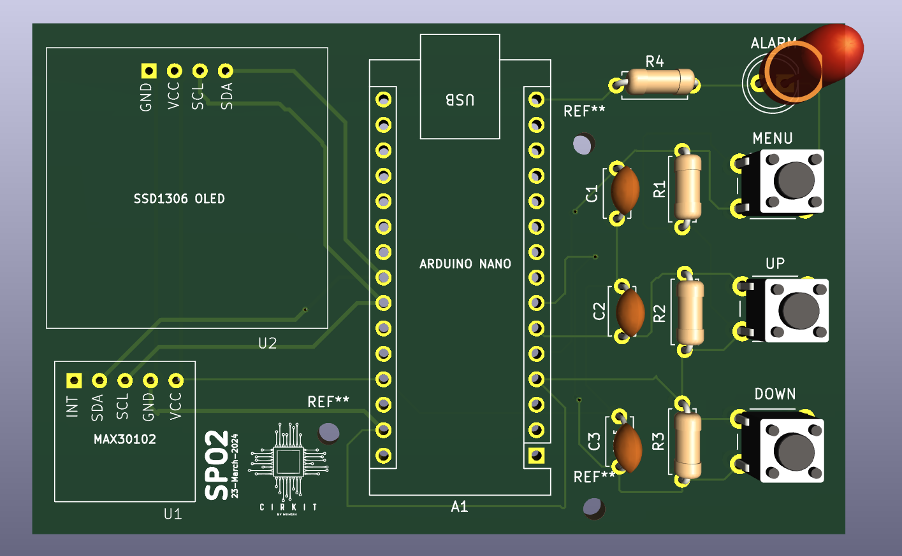

# PULSE-OXIMETER-USING-MAX30102-ARDUINO-NANO

This project is a custom-designed PCB for a Pulse Oximeter using the MAX30102 sensor and an Arduino Nano. The PCB was designed in **KiCad** and aims to provide a compact, efficient, and user-friendly solution for monitoring heart rate and SpO2 levels.

---

## 🛠️ Features

- 📟 **OLED Display (SSD1306)** for real-time data visualization  
- 🩸 **MAX30102** sensor for accurate pulse and SpO2 detection  
- 🧠 **Arduino Nano** for core processing  
- 🔘 **Tactile Buttons** for menu navigation (`MENU`, `UP`, `DOWN`)  
- 🚨 **Alarm LED** for alerts  
- 🧰 Easy-to-connect headers for sensor modules  
- 🎯 Clean silkscreen labels for easy component placement

---

## 🧩 Components

| Label  | Component        | Description                  |
|--------|------------------|------------------------------|
| U1     | MAX30102         | Pulse & SpO2 sensor          |
| U2     | SSD1306 OLED     | 0.96" I2C OLED display       |
| A1     | Arduino Nano     | Microcontroller              |
| R1-R4  | Resistors         | Pull-up/down for buttons     |
| C1-C3  | Capacitors        | Debouncing & filtering       |
| ALARM  | LED               | Visual alert                 |
| MENU, UP, DOWN | Tactile Push Buttons | User Interface Controls |

---

## 📷 PCB Layout (3D View)



---

## 🔧 Getting Started

**1.** **Clone the Repository**
   ```bash
   git clone https://github.com/your-username/PULSE-OXIMETER-USING-MAX30102-ARDUINO-NANO.git
   ```

**2.** **Open in KiCad**

- Open PulseOximeter.kicad_pro in KiCad v6 or above.

**3.** **Generate Gerbers**

- Use KiCad’s Plot function to generate the Gerber files.

**4.** **Upload to Manufacturer**

- Send the Gerbers to your preferred PCB manufacturer (e.g., JLCPCB, PCBWay).

## 💡 Notes
- Make sure to solder components as per the silkscreen labels.

- The MAX30102 and OLED communicate via I2C (SDA/SCL lines shared).

- Alarm LED can be controlled via digital pin to indicate high/low SpO2.

## 🧑‍💻 Author

Designed and developed by **Mohsin** under the brand **Cirkit**  
📅 Date of Design: 23rd March, 2025  
🔗 [LinkedIn](https://linkedin.com/in/mohsin-m99) • [GitHub](https://github.com/mohsin1845)


